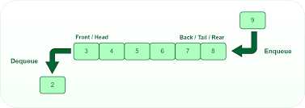

Yesterday, and parts of today, I covered stack data structures and saw the different ways stacks can be implemented using othe data structures I covered before. Today, I deepdive into queues 🚶🚶🚶🚶🚶

## 4. Queues

Like stacks, queues are a linear data structure in which elements are held in a sequence and access is restricted to one end. Elements are added (“enqueued”) at the rear end and removed (“dequeued”) from the front. This makes queues a First-In, First-Out (FIFO) data structure. Good examples include people standing in a line at the supermarket or waiting to be served by a teller at a bank. The first person in the line will be the one to pay or be served first and leave.

<figure>
    
    <figcaption align="center">Teller Line</figcaption>
</figure>

The following terms are regularly used with stacks. These also double up as the operations done on a stack.

<ol>
    <li>Enqueue - add a new element to the queue</li>
    <li>Dequeue - remove and return the first element from the queue</li>
    <li>Peek - retrieve the topmost element without removing it from the queue</li>
</ol>

<figure>
    
    <figcaption align="center">Queue operations</figcaption>
</figure>

The implementation for these will be done in the subsequent <i>.py</i> files.

### Implementation of queues
1. Implement as an array

Once again, arrays come in handy when implementing another data structure. The figure below shows how it looks like when a queue is implemented using an array.

<figure>
    
    <figcaption align="center">Array implementation of queues</figcaption>
</figure>

One of the biggest con of using arrays to implement queues is the shifting costs. Dequeue removes the first element and the other elements must be shifted to take up the free spaces before them. If the queue is long this can be extremely inefficient. 

2. Implement as an linked list

Linked lists solve the problems of arrays. Since they're dynamic, queues can grow and shrink as needed, and the crown: no shifting is required - the other elements don't have to be shifted in memory after a dequeue operation. But then this comes at a cost of extra memory since each element has to contain the address of the next/previous elements.

<figure>
    
    <figcaption align="center">Implementing queues using linked lists </figcaption>
</figure>

3. Implement as a collection

Just like in stacks, we can use the deque collection to implement  a queue. The difference comes in the methods used, we'll see this in an example.

### Applications of queues
1. Message sending

Queues are used in messaging apps to maintain the heirarchy of text messages irrespective of whether a user is online or offline. When a user comes online, the messages in the queue gets delivered and the queue emptied

2. Process scheduling in operating systems

Queues are used to implement round robin scheduling algorithms in computer systems

3. Switching and routing

Both switches and routers maintain inbound and outbound queues to store packets

4. Customer service systems

Call center phone systems are developed using queue data structures. The first customer to call will be the first one to be served.

#### References
1. [DSA - Queues](https://www.w3schools.com/dsa/dsa_data_queues.php)
2. [Implementing queue data structures](https://www.youtube.com/watch?v=rUUrmGKYwHw)
3. [A comprehensive look at queue in data strcture](https://www.simplilearn.com/tutorials/data-structure-tutorial/queue-in-data-structure)
