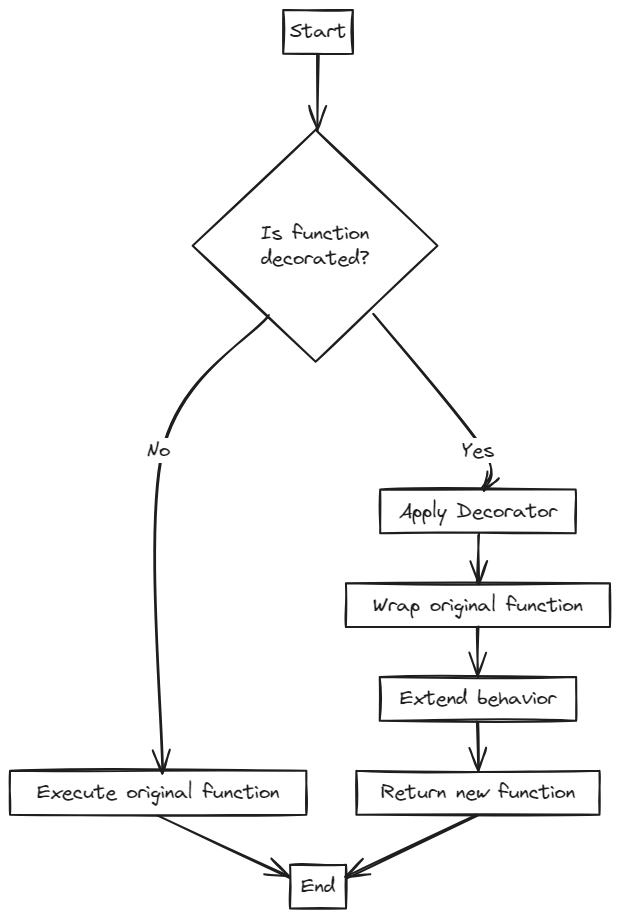
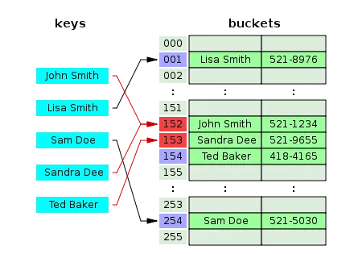
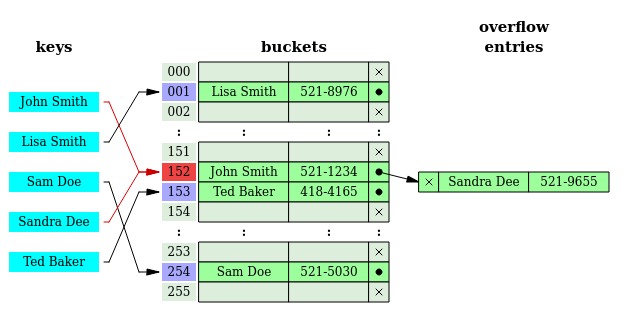

This is the last of basic data structures. Over the next few days, I will be learning more about hash tables, also called hash maps.

## 5. Hash maps/tables

Hash tables are specialized data structures that allow fast access to data based on a key - data is stored in an associative manner. Essentially, a hash table works by taking a key input, and then computes an index into an array in which the desired value can be found. It uses a hash function to calculate this index. The process of mapping the keys to appropriate locations (or indices) in a hash table is called <i>hashing</i>.

Hash tables are particularly efficient when the maximum number of entries can be predicted in advance.

<figure>
    
    <figcaption>Hash table</figcaption>
</figure>

### How a hash map works

<figure>
    
    <figcaption>How a hash map works</figcaption>
</figure>

A hash map is a concrete implementation of an associative array. At the fundamental level, it maps keys to values. Here's how hash maps work:

1. Key-pair storage - a hash map stores key-value pairs and associayes the supplied key with the value so later on the value can be retrieved using the key.

2. Hash function - a hash function is used to compute an index into an array of buckets or slots from a key. The hash function is an algorithm that produces an index of where a value can be found or stored in the hash table.

3. Bucket array - the hash map internally maintains an array, also known as a "bucket array". Each index position in the array is a bucket that can hold multiple Node objects using a LinkedList.

4. Handling collisions - a collision occurs when 2 different keys hash to the same bucket. There are solutions on how to handle these collisions, which will be handled in the collisions section.

5. Key retrieval - to retrieve a value, the hash map uses the key to compute the hash, which indicates the bucket. The bucket is then searched to find the matching key and return its corresponding value.

### Advantages of hashing
1. Speed - the access time of an element is on average 0(1) (complexities will be covered after this). This makes the lookup action very fast.

### Hash functions

A Hash function is a mathematical function that converts a given numeric or alphanumeric key to a small practical integer value. The mapped integer value is used as an index in the hash table. In simple terms, a hash function maps a significant number or string to a small integer that can be used as the index in the hash table.

A hash function ensures that the elements are uniformly distributed. It produces a unique set of integers within some suitable range in order to reduce the number of collisions.

#### Properties of a good hash function
1. <u>Uniformity</u>

A good hash function must map the keys as evenly as possible. This means that the probability of generating every hash value in the output range should roughly be the same. This also helps in reducing collisions.

2. <u>Deterministic</u>

A hash function must always generate the same hash value for a given input value.

3. <u>Low cost</u>

execution costs of hash functions must be as low as possible so that hashing is prefered over tradiotional approaches.

#### Examples of hash functions
1. <u>Division method</u>

Given that:
- k is a key value
- M is the size of the hash table

this hash function will divide the value k by M and use the remainder obtained as a hash. Generally, M is best suited to be a prime number because that makes sure that the keys are more uniformly distributed

2. <u>Mid square method</u>

In this method, the following steps are taken to compute the hash value:

- Square the value of the key
- The middle r digits of the result are extracted.
- The result r is the hash obtained.

This method works well because most or all digits of the key-value contribute to the resulting hash.

3. <u>Folding method</u>

This method involves the followings steps:

- Divide k into a number of parts i.e. k1, k2, k3,….,kn, where each part has the same number of digits except for the last part that can have lesser digits than the other parts.
- Add the individual parts to obtain the hash. Ignore the last carry if any.

4. <u>Multiplication method</u>

This method has the following steps:

- Choose a constant value, say A, such that 0 < A < 1
- Multiply k by A
- Extract the fractional part of kA
- Multiply the fractional part extracted by M

### Collisions

In simple terms, collisions occur when the hash function maps 2 different keys to the same location. Normally, two records can't be stored in the same location of a hash table.

The methods used to solve collisions are called <i>collision resolution techniques.</i> There are 2 popular collision resolution techniques:

1. <u>Open Addressing</u>
<figure>
    
    <figcaption>Open addressing technique</figcaption>
</figure>

Consider the image above. John Smith and Sandra Dee are colliding.How this happens? Ideally, there are unlimited key possibilities but a finite amount of space to put these keys in. Eventually there will be some collision where different keys will be hashed to result in the same location. In the image above 152 is a collision. So how does open addressing solve this issue?

Once a collision takes place, open addressing (also known as closed hashing ) computes new positions using a probe sequence and the next record is stored in that position. There are some well-known probe sequences:

1. Linear Probing: The interval between the probes is fixed to 1. This means that the very next available position in the table would be tried.
2. Quadratic Probing: The interval between the probes increases quadratically. This means that the next available position that would be tried would increase quadratically.
3. Double Hashing: The interval between probes is fixed for each record but the hash is computed again by double hashing.

2. <u>Chaining</u>
<figure>
    
    <figcaption>Chaining technique</figcaption>
</figure>

In this technique, each location in a hash table stores a pointer to a linked list that contains all the key values that were hashed to that location. As new collisions occur, the linked list grows to accommodate those collisions forming a chain.

This means that each location in the hash table is not linited to store one value. Searching for a value in a chained hash table is as simple as scanning a linked list for an entry with the given key.

Insertion operation appends the key to the end of the linked list pointed by the hashed location. Deleting a key requires searching the list and removing the element.

The only problem with this technique is if the linked list becpmes large enough, it takes 0(n) time to search one position. This occurs if the hash table is too small and has to accommodate many values.

#### References
1. [Hash Functions and list/types of Hash functions](https://www.geeksforgeeks.org/hash-functions-and-list-types-of-hash-functions/)
2. [What is a hash map](https://www.freecodecamp.org/news/what-is-a-hash-map/)
3. [DSA Handbook - Hash tables](https://www.thedshandbook.com/hash-tables/)
4. [How hash maps work](https://stackoverflow.com/questions/66976826/java-hashmap-please-explain-how-hash-maps-work)
5. [Hash tables - 1](https://www.youtube.com/watch?v=ea8BRGxGmlA)
6. [Hash tables - 2](https://www.youtube.com/watch?v=54iv1si4YCM)
7. [Handling collisions in a hash table](https://medium.com/@jonathansychan/handling-collisions-in-a-hash-table-68a0fac508a)
8. [Hash map in Python](https://www.geeksforgeeks.org/hash-map-in-python/)
