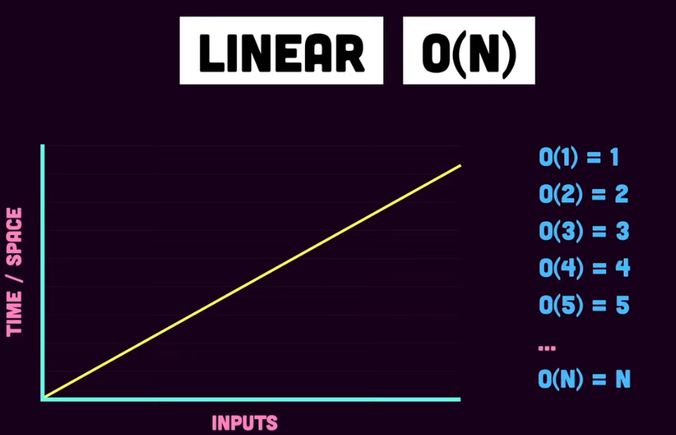
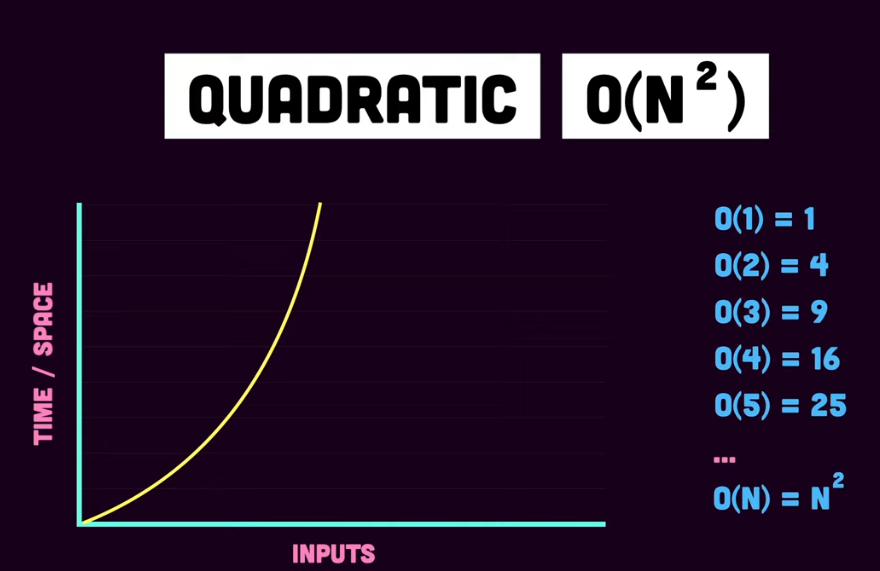
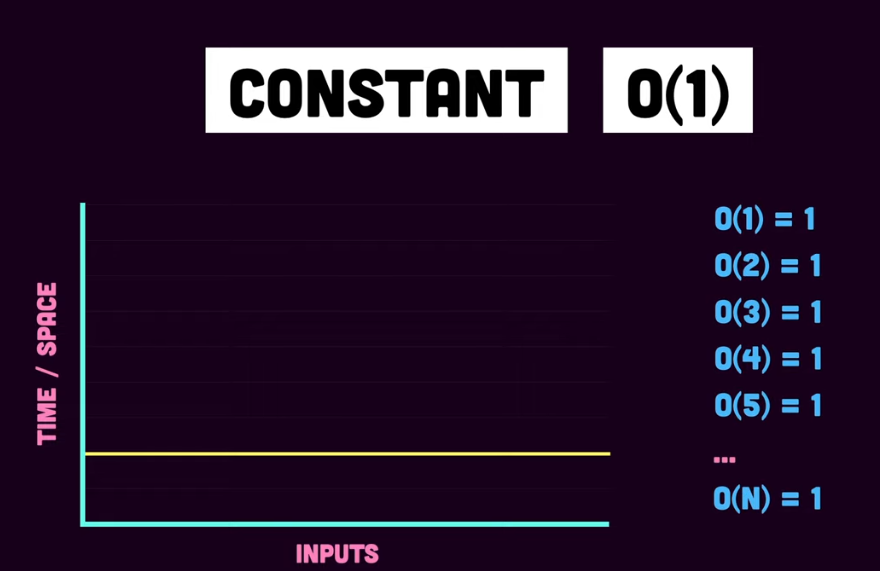
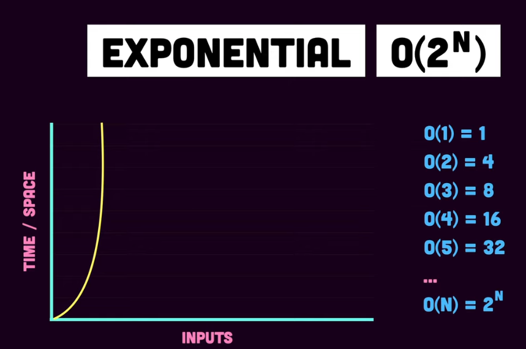
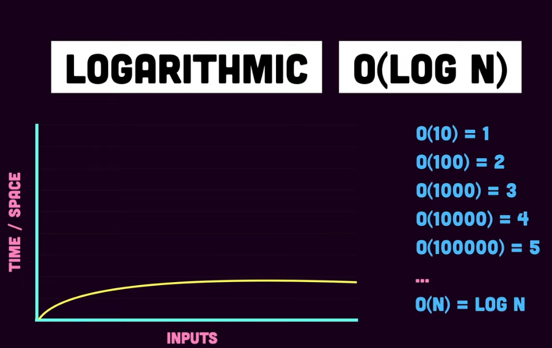
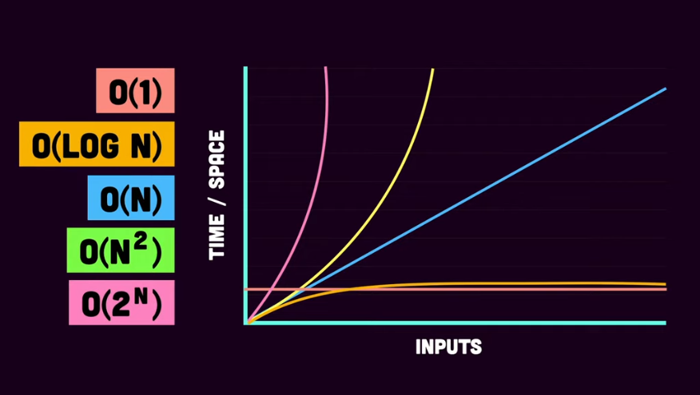

## How to calculate complexity

LIke I'd said earlier while introducing complexities, there are two aspects of an algorithm that are most important in computer science: the time it takes to run the algorithm and the space it takes in the memory.

There are 3 different notations used to represent complexites:

1. <u>Big-O notation</u>

This is the behaviour of an algorithm in the worst case

2. <u>Big-Ω notation</u>

This is the behaviour of an algorithm in the best case

3. <u>Big-Θ notation</u>

This is the behaviour of an algorithm in the average case

### Big-O notation

This is where the main focus lies because it represents the maximum number of steps taken by an algorithm to solve a problem.

Time and space complexities of an algorithm are calculated by counting the number of statements the program has to execute.

Let's see the common complexities and how they work:

1. <u>Linear complexity</u>

In linear complexity, time/space taken grows linearly with the increase in the number of inputs. For example, for an input of 1, the time and space complexity would be 1 i.e O(1)=1, O(2)=2, ... O(N)=N. An example of a linear complexity algorithm is a simple loop that loops over the items and returns each item.
<figure>
    
    <figcaption>Linear Complexity</figcaption>
</figure>

2. <u>Quadratic complexity</u>

In quadratic complexity, time and space taken scales (squares) with the number of inputs. For example, for an input of 1, the time/space complexity is 1, 2 is 4 i.e O(2)=4, O(3)=9, ... O(N)=N2
<figure>
    
    <figcaption>Quadratic Complexity</figcaption>
</figure>

3. <u>Constant complexity</u>

In constant complexity, the time/space taken will remain the same regardless of the number of inputs. An algorithmic example of this would be accessing items from an array. When only 1 item is accessed, the complexity would be 1, if there are 2 items to be accesed, the complexity would still be 1 i.e O(1)=1, O(2)=1, ... O(N)=1
<figure>
    
    <figcaption>Constant Complexity</figcaption>
</figure>

4. <u>Exponential complexity</u>

In exponential complexity, there is exponential growth in time/space with increase of inputs. An algorthmic example of this would be the fibonacci series.
<figure>
    
    <figcaption>Exponential Complexity</figcaption>
</figure>

5. <u>Logarithmic complexity</u>

Logarithmic complexity mixes both linear and exponential complexities i.e inputs increase exponentially while time/space taken to execute the algorithm grow linearly.
<figure>
    
    <figcaption>Logarithmic Complexity</figcaption>
</figure>

### How the complexities compare to each other

Consider the image below:
<figure>
    
    <figcaption>Complexities Comparison</figcaption>
</figure>

Ideally, it would be best if an algorithm takes the least amount of space and time while executing, given the worst case scenario.

In the image above, constant complexity has the best of both followed by logarithmic complexity.

#### References
1. [Calculate time complexity](https://www.youtube.com/watch?v=Z0bH0cMY0E8)
2. [Understanding Time Complexity with Simple Examples](https://www.geeksforgeeks.org/understanding-time-complexity-simple-examples/)
3. [Big-O Notation](https://www.youtube.com/watch?v=IR_S8BC8KI0&t=33s)
