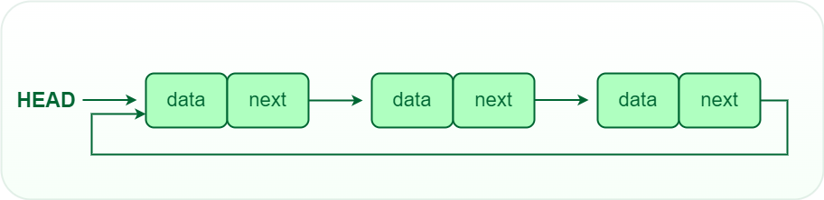
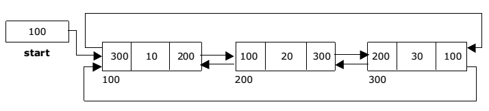

This is a continuation of the basic data structures. Yesterday, I covered arrays. Today I will look into linked lists.

## 2. Linked Lists

Linked lists are a linear data structure, like arrays, in which elements are not stored in contigous memory location, unlike arrays. They form a series of connected nodes, where each node contains a data field and the address(reference) of the next node

<figure>
    
    <figcaption align="center">Linked list</figcaption>
</figure>

The following terms are regularly used with linked lists:

<ol>
    <li>Node - holds the data field and the pointer to the next node</li>
    <li>Data - holds the actual value associated with a node</li>
    <li>Next Pointer - stores the memory address of the next node in the sequence</li>
    <li>Head - first node in the list, this is where the linked list is accessed through</li>
    <li>Tail - last node in the list which points to a null</li>
</ol>

### Types of linked lists

There are 3 major types of linked lists:

<ol>
    <li>
        
Singly linked list

        
This is the simplest type in which every node contains some data and a pointer to the next node of the same data type. Traversal is only one way, forward direction.

        <figure>
                    
                    <figcaption align="center">Singly linked list</figcaption>
        </figure>
    </li>
    <li>
        
Doubly linked list

        
This is like a singly linked list, but instead of having a pointer to the next node only, it has an additional pointer to the previous node as well. Traversal can be in both forward and backward directions.

        <figure>
                    
                    <figcaption align="center">Doubly linked list</figcaption>
        </figure>
    </li>
    <li>
        
Circular linked list

        
This is a list in which the last node contains the pointer to the first node of the list. It has no beginning or end because it allows traversal in any direction until we get to the same node we started from. There are both circular singly and circular doubly linked lists.

        <figure>
                    
                    <figcaption align="center">Circular singly linked list</figcaption>
        </figure>
        <figure>
                    
                    <figcaption align="center">Circular doubly linked list</figcaption>
        </figure>
    </li>
</ol>

### Linked lists vs Arrays

The following table shows how arrays and linked lists compare:

<table>
    <tr>
        <th>Arrays</th>
        <th>Linked lists</th>
    </tr>
    <tr>
        <td>Stored in contigous locations</td>
        <td>Stored in non-contigous locations</td>
    </tr>
    <tr>
        <td>Memory is allocated at compile time</td>
        <td>Memory is allocated at run time</td>
    </tr>
    <tr>
        <td>Uses less memory</td>
        <td>Uses more memory because it stores both data and pointer to next node</td>
    </tr>
    <tr>
        <td>Elements can be accessed easily</td>
        <td>Accessing elements requires the traversal of the whole linked list</td>
    </tr>
    <tr>
        <td>Insertion and deletion of items takes time</td>
        <td>Insertion and deletion operation is faster</td>
    </tr>
</table>

#### References
1. [DSA - Linked lists](https://www.youtube.com/watch?v=qp8u-frRAnU)
2. [Linked list data structure](https://www.geeksforgeeks.org/data-structures/linked-list/?ref=lbp)
3. [Circular linked lists](https://www.scholarhat.com/tutorial/datastructures/circular-linked-list-in-data-structures)
