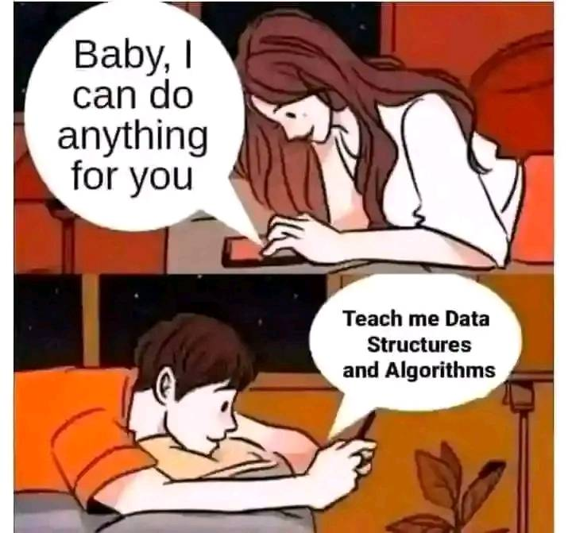

    

<h2 align="center" style="font-size: 40px; font-weight: bold;"> Data Structures and Algorithms
      
</h2>

Personalized learning towards improving my Data Structures and Algorithm knowledge. Throughout the learning, I will be using various resources but my main ones are:
        <ul>
            <li style="font-size: 20px;"><a href="https://www.amazon.in/Structures-Algorithms-Undergraduate-Computer-Science/dp/3319130714">Data Structures and Algorithms with Python by Kent D. Lee and Steve Hubbard</a></li>
            <li style="font-size: 20px;"><a href="https://roadmap.sh/datastructures-and-algorithms">Data Structures and Algorithms Roadmap on roadmap.sh</a></li>
            <li style="font-size: 20px;"><a href="https://www.w3schools.com/dsa/index.php">DSA Tutorial on W3Schools</a></li>
        </ul>

<h3 style="font-size: 30px;">📝 Table of Contents</h3>
<ol>
    <li style="font-size: 20px;"><a href="https://github.com/R-Owino/100DaysofALXSE/tree/main/Day%201">Introduction to Data Structures and Algorithms</a></li>
    <li style="font-size: 20px;"><a href="https://github.com/R-Owino/100DaysofALXSE/tree/main/Day%202">Picking a Language</a></li>
    <li style="font-size: 20px;"><a href="https://github.com/R-Owino/100DaysofALXSE/tree/main/Day%203">Python Programming 101</a></li>
    <li style="font-size: 20px;"><a href="https://github.com/R-Owino/100DaysofALXSE/tree/main/Day%204">Basic Data Structures - Arrays</a></li>
    <li style="font-size: 20px;"><a href="https://github.com/R-Owino/100DaysofALXSE/tree/main/Day%205-9">Basic Data Structures - Linked Lists</a></li>
</ol>
